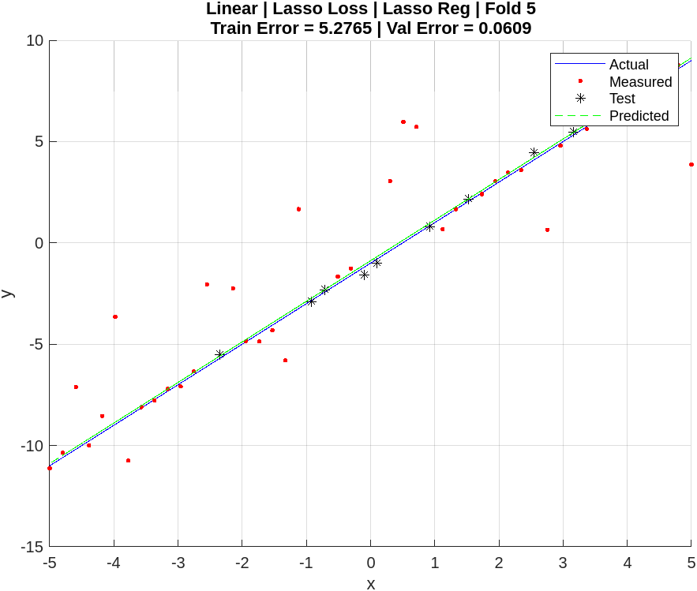
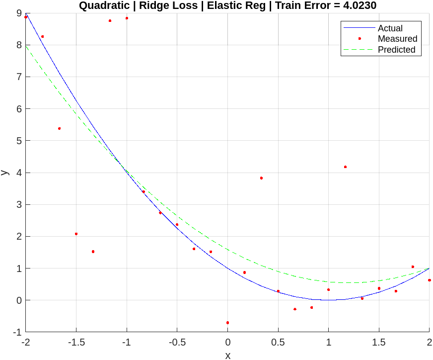

# Gradient Descent
This project implements gradient descent for linear and quadratic regression from scratch in MATLAB.

It includes:
- Synthetic data generation for linear and quadratic models
- Data standardization and inversion utilities
- Input validation and outlier injection
- Modular gradient descent solvers for linear and quadratic regression
- Support for **Lasso** and **Ridge** loss functions
- Configurable regularization: **Lasso**, **Ridge**, and **Elastic Net**
- Optional K-fold cross-validation
- Clear visualizations of fits and prediction results

## Author
Serge Alhalbi

## Company
Riverain Technologies

## Collaborators
- Jason Knapp  
- Xiaotian (Dennis) Wu

## Tools and Libraries
- MATLAB

## Usage
```bash
git clone https://github.com/SergeAlhalbi/gradient-descent.git
cd gradient-descent
```

## Results
Below are a few selected results:

- **Linear data**, **Lasso loss**, **Lasso regularization**, using **5-fold cross-validation**:
  
  

- **Quadratic data**, **Ridge loss**, **Elastic regularization**:
  
  
